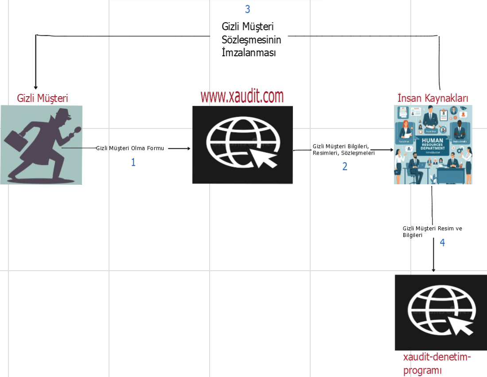

# Denetim ve Gizli Müşteri  

Gizli müşteri , işletmelerin hizmet kalitesini, müşteri deneyimini ve süreçlerdeki uyumluluğu değerlendirmek amacıyla gerçek bir müşteri gibi davranarak çalışan bir denetim yöntemidir.  
Bu yöntem, yalnızca müşteri memnuniyetini artırmayı hedeflemekle kalmaz, aynı zamanda **mali denetim** gibi kritik alanlarda da önemli bir rol oynar.  

Özellikle ülkemizde, alışveriş merkezleri (AVM) ciro bazlı kira artışı uygulamalarını benimsemektedir. Bu durum, döviz bazlı artışların yasal kısıtlamalara tabi olduğu günümüzde, kiracıların cirolarını doğru ve şeffaf bir şekilde raporlamasını daha kritik hale getirmiştir.  

Gizli müşteriler, bu süreçte AVM yönetimleri için önemli bir denetim aracı haline gelir. Örneğin:  
- Müşteriye fiş kesilip kesilmediği,  
- Kesilen fişin tutarı ve formatının doğruluğu,  
- Kiracının gerçekten kendi kredi kartı POS cihazını kullanıp kullanmadığı gibi bilgiler,  

Bu veriler, AVM yönetimlerinin kiracılar hakkında doğru değerlendirmeler yapmasını sağlar.  

## Projenin Özeti  

Geliştirilen bu proje, denetim firmalarının hem **müşteri deneyimi** hem de **mali denetim** süreçlerini daha kolay, hızlı ve etkili bir şekilde yönetebilmesi amacıyla tasarlandı.  

🔗 [Projenin canlı demosunu izlemek için](https://drive.google.com/file/d/1Gzg8g0Duj2yDEQglsrg80h_k4kTuLzpc/view?usp=drive_link)

### Özellikler  

1. **Başvuru Süreci**  
   - Gizli müşteri adaylarının platform üzerinden başvuru yapmaları sağlanır.  
   - Adaylara, mali denetim ve müşteri deneyimi analizi için uygunluklarını değerlendirecek kapsamlı sorular yöneltilir.  
   - Ayrıca, adaylardan kendilerini tanıtan bilgiler ve fotoğraflar talep edilir.  

2. **Admin Paneli**  
   - İnsan kaynakları personeli, belirli bir tarih aralığında başvuran gizli müşteri adaylarının bilgilerine erişebilir.  
   - Adayların kişisel bilgileri **Excel** formatında, yükledikleri fotoğraflar ise **ZIP** dosyası olarak indirilebilir.  
   - Bu sayede, veriler şirket içi yazılımlara kolayca entegre edilebilir.  

3. **Otomatik Sözleşme Üretimi**  
   - Gizli müşteri sözleşmelerinin manuel hazırlanması zaman alıcı bir süreçtir.  
   - Bu proje, süreci otomatikleştirerek insan kaynakları personelinin iş yükünü hafifletir ve süreci hızlandırır.  

## Avantajlar  

- **Sistematik Süreç:** Gizli müşteri yöntemiyle müşteri memnuniyeti ve mali denetim süreçleri profesyonel şekilde yürütülür.  
- **Doğru Aday Seçimi:** Detaylı bilgi toplanarak operasyonlar için uygun kişilerin seçilmesi sağlanır.  
- **Verimlilik:** Otomasyon sayesinde zaman tasarrufu ve operasyonel verimlilik artar.  

> **Not:**  
> Gizli müşteri yönteminin doğru uygulanması, özellikle **AVM ciro denetimlerinde**, bir firmanın gelir yönetimi ve operasyonel başarısı için kritik öneme sahiptir. Bu nedenle, sistematik bir süreç tasarımı başarıyı artırmanın anahtarıdır.




# Projede Kullanılan Teknolojiler

| Teknoloji        | Sürüm       |
|------------------|-------------|
| **Java**         | 17.0.7      |
| **Spring Boot**  | 3.3.2       |
| **MySQL**        | 8.0.40      |
| **Node.js**      | 19.9.0      |
| **Frontend**     | Vue.js (Vue3 - 3.4.29) |

---

## Uyumlu Sürümler

### Java
- **Minimum Gereksinim:** `Java 17`
- **Önerilen Sürüm:** `Java 17.0.7` ve üzeri
- **Uyumsuz Sürümler:** `Java 16` ve altı. Daha yeni sürümler (`Java 18+`) çalışabilir ancak bazı ek yapılandırmalar gerekebilir.

### Spring Boot
- **Minimum Gereksinim:** `Spring Boot 3.3.0`
- **Önerilen Sürüm:** `Spring Boot 3.3.2` ve üzeri
- **Uyumsuz Sürümler:** `3.2.x` ve altı sürümler, kullanılan bağımlılıklarla uyumsuz olabilir.

### MySQL
- **Minimum Gereksinim:** `MySQL 8.0.20`
- **Önerilen Sürüm:** `MySQL 8.0.40` ve üzeri
- **Uyumsuz Sürümler:** `MySQL 5.x` ve altı sürümler; veri türleri ve SQL sorguları ile uyum sorunları yaşanabilir.

### Node.js
- **Minimum Gereksinim:** `Node.js 19.0.0`
- **Önerilen Sürüm:** `Node.js 19.9.0`
- **Uyumsuz Sürümler:** `Node.js 18.x` ve altı sürümlerle Vue.js (Vue3) için bazı modern özellikler kullanılamayabilir.

### Vue.js
- **Kullanılan Versiyon:** `Vue.js 3.4.29`
- **Minimum Gereksinim:** `Vue.js 3.0.0`
- **Uyumluluk:** Proje, Vue3'ün tüm özelliklerini kullanacak şekilde tasarlanmıştır. Daha önceki sürümlerle (Vue2) uyumsuzdur. Vue.js `3.4.x` serisi ile tam uyumludur.

## Project Setup

```sh
npm install
```

### Compile and Hot-Reload for Development

```sh
npm run dev
```

### Compile and Minify for Production

```sh
npm run build
```
